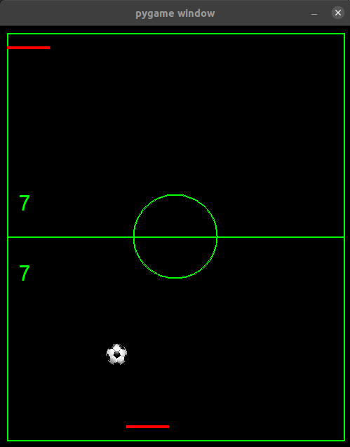

**PingPong Game com simples Redes Neurais**

Este é um pequeno projeto que fiz durante meu 4º semestre na graduação para aprender 
sobre inteligências artificiais e redes neurais. Havia feito este game tipo PingPong
um ano antes. Com base no game, construí um simples sistema para construir pequenas
redes neurais e uma ‘interface’ para que os _Output_ das redes pudessem controlar o game.

O game utiliza a biblioteca pygame para construir os elementos, desenhar num canvas 
e atualizar os frames.

As redes neuras são construídas com a biblioteca numpy, podendo selecionar número de
entrada, saídas, camadas ocultas e número de nós por camada.

Com a classe Event_controller é possível selecionar como serão controlados os dois 
jogadores, podendo ser rede vs rede, player vs rede, player vs player.

Rodar configuração padrão:
`$ python main.py`
